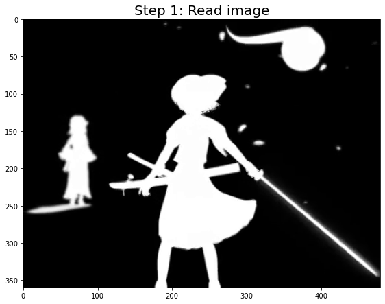

# Requirements

**Python 3 (preferably latest version)**

**Python modules:**
- numpy
- matplotlib
- skimage
- tqdm

**External:**
- ffmpeg - needs to be installed in `PATH`
- LKH-3 (Keld Helsgaun) - http://webhotel4.ruc.dk/~keld/research/LKH-3/

---
# Processing steps
Each frame is processed using the following steps:
1. Read image
2. Compute contours
3. Merge contours end to end (used for interpolation)
    1. Compute timestamps for interpolation for each contour individually
    2. Merge contours so that we can easily interpolate across all contours
4. Solve Travelling Salesman Problem
    1. Convert to TSP instance
    2. Call the LKH-3 solver
    3. Interpolation for merged tour
5. Remove FFT frequencies
6. Transparent contour based on sample distances
7. Square waves

Check out `oneframe_demo.ipynb` for a detailed demonstration with plots after every step:

 

# Original Video
https://www.youtube.com/watch?v=FtutLA63Cp8

# Rendered using a few sinusoids
Result: https://www.youtube.com/watch?v=ad5Bo3N-D9E

## Rendered using Square waves (squarewave branch)
Result: https://www.youtube.com/watch?v=OG9G8nK2q_Q

