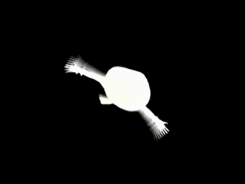
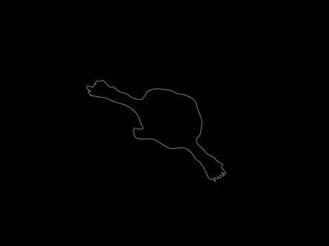
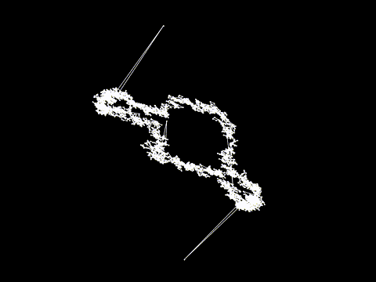

# Requirements

**Python 3 (preferably latest version)**

**Python modules:**
- numpy
- matplotlib
- skimage
- tqdm

**External:**
- ffmpeg - needs to be installed in path
- LKH-3 (Keld Helsgaun) - http://webhotel4.ruc.dk/~keld/research/LKH-3/

---

# Original Video
https://www.youtube.com/watch?v=FtutLA63Cp8

# Render Bad Apple animation using Fourier frequencies
Each frame is rendered using the following steps:
1. Detect the contours in the original Bad Apple video
2. Join the contours so that they form a continuous line
3. Convert the (x, y) points to complex numbers
4. Compute the FFT, keep the 48 most important frequencies, then get a line back by applying the inverse FFT
5. Draw the line. The transparency of the line depends on the distance between sample points. Therefore, when the line quickly jumps across the image, it's more transparent.

Result: https://www.youtube.com/watch?v=ad5Bo3N-D9E

## Square waves (squarewave branch)
Same idea, but the contour is drawn using a sum of square waves, instead of sinusoids

Result: https://www.youtube.com/watch?v=OG9G8nK2q_Q

